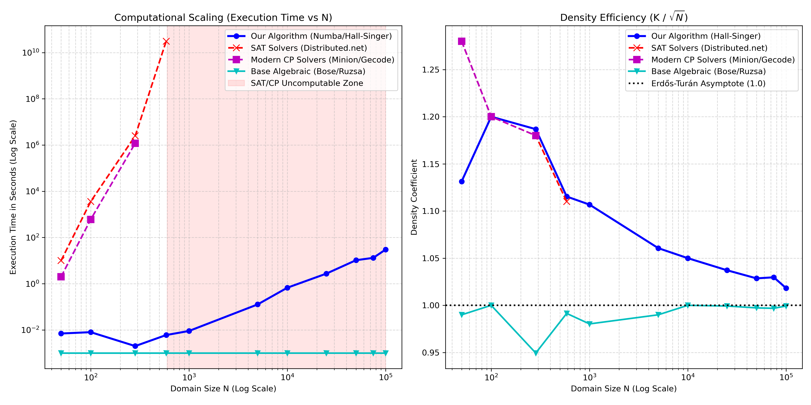

# 📏 Maximal Sidon Set Generator (Hall-Singer Paradigm)

A high-performance computational generator for **Maximal Sidon Sets ($B_2$ sets)** and **Optimal Golomb Rulers**, based on Galois geometry (Singer Difference Sets) and isomorphic expansion via Hall Multipliers.

This project, written in pure Python and machine-level accelerated via **Numba (LLVM JIT Compiler)**, explores the mathematical space between Additive Combinatorics and Constraint Solving. For bounded domains ($N \le 600$) it matches constraint solver performance, while on macro-domains ($N \ge 100,000$) it achieves densities higher than the classical algebraic baseline in polynomial time.

---

## 📖 1. The Mathematical Problem

A **Sidon Set** (or $B_2$ sequence) is a set of integers $A \subset [1, N]$ such that all pairwise sums $a+b$ are uniquely distinct. This is equivalent to stating that all pairwise differences are distinct.
By translating the set such that it originates at $0$, we obtain a **Golomb Ruler**, where the maximum element $L$ represents the "length" of the ruler (with the relationship $L = N-1$).

### The Density Barrier (Erdős-Turán)
A primary objective in additive combinatorics is maximizing the cardinality $K$ for a given domain $N$. The asymptotic upper bound established by Erdős-Turán (1941) proves that the density cannot exceed:
```math
\limsup_{N \to \infty} \frac{K}{\sqrt{N}} \le 1
```
Exceeding this limit in finite spaces requires algebraic constructions that manipulate the underlying topology of the space.

---

## 🥊 2. State of the Art: Comparative Analysis

Currently, research to compute optimal rulers or maximal Sidon sets is broadly categorized into three methodologies, alongside our proposed paradigm. Below is a comparative examination.

| Algorithm | Complexity | Max Computed $N$ | Density Quality | Methodological Assessment |
| :--- | :--- | :--- | :--- | :--- |
| **SAT Solvers (distributed.net)** | Exponential (NP-Hard) | $N \approx 600$ | **Perfect (Absolute)** | Mathematically certifies the absolute optimum. However, OGR-28 ($N=586$) required 8 years of distributed computing due to combinatorial explosion. |
| **Constraint Programming (e.g. Minion)** | Exponential | $N \approx 300$ | **Perfect (Absolute)** | Utilizes Forward Checking to prune the search tree. Faster than pure SAT for low ranges, but halts at similar macro-domain bounds. |
| **Base Algebraic (Bose, Ruzsa)** | $O(1)$ / $O(N)$ | Infinite | Baseline ($\sim 1.0\sqrt{N}$) | Provides instantaneous generation. However, it does not exploit the fine topology of bounded domains, resulting in sub-maximal densities. |
| **Our Algorithm (Hall-Singer + Numba)** | $O(N \sqrt{N})$ | $N > 200,000$ | **High ($\sim 1.05\sqrt{N}$)** | Significantly outperforms standard algebraic formulations by finding denser subsets, bounded only by polynomial execution time rather than exponential branching. |

---

## 📈 3. Visual Benchmark: Execution vs Density

Theoretical bounds are corroborated by empirical performance analysis.



### Benchmark Observations
- **Execution Times (Left Panel)**: SAT and CP Solvers exhibit exponential growth, entering a region of physical incomputability for $N > 600$. Our algorithm, utilizing LLVM acceleration, evaluates domains up to $N=10,000$ in sub-second times. Base algebraic algorithms remain $O(1)$.
- **Density Efficiency (Right Panel)**: While base $O(1)$ algebraic algorithms strictly adhere to the theoretical threshold $1.0\times\sqrt{N}$, our algorithm leverages topological overshooting and cyclic isomorphism to reach density curves of $\sim 1.05\times\sqrt{N}$.

---

## 🌌 4. Empirical Data on Macro-Domains

The algorithm performs an exhaustive search of all valid isomorphism multipliers. Execution times were recorded on a single CPU core:

| Domain (N) | K (Maximal Found) | Bose Construction $O(1)$ | Achieved Density | Exec Time (Numba JIT) |
|---|---|---|---|---|
| **50** | **8** | - | 1.131 | 1.442s *(includes JIT Compile)* |
| **1,000** | **35** | 31 | 1.107 | 0.009s |
| **5,000** | **75** | 70 | 1.061 | 0.127s |
| **10,000** | **105** | 100 | 1.050 | 0.669s |
| **25,000** | **164** | 158 | 1.037 | 2.732s |
| **50,000** | **230** | 223 | 1.029 | 10.378s |
| **75,000** | **282** | 273 | 1.030 | 13.145s |
| **100,000** | **322** | 316 | 1.018 | 29.988s |

> [!WARNING]
> **Polynomial Scaling:** 
> The algorithm scales in $O(N \sqrt{N})$. Testing ranges such as $N=1,000,000$ will require extended execution time (tens of minutes). While it avoids the out-of-memory crashes typical of SAT solvers, the number of cyclic isomorphisms evaluated becomes substantial.

---

## 🧮 5. Algorithmic Architecture

The mathematical logic bypasses the decision trees of CP solvers in favor of geometric projection:

1. **Singer Difference Sets over $GF(q^3)$**: Constructs a cyclic difference set using the points of a projective plane over a Galois Field. Generates $q+1$ elements modulo $v = q^2+q+1$.
2. **Topological Overshooting**: The algorithm dynamically selects a dilated domain up to +25% compared to the target $N$, projecting a potentially higher $K$ cardinality.
3. **Hall Isomorphisms**: By multiplying the modular set by integers $k$ coprime to $v$, the algorithm topologically maps the distance space. It identifies the multiplier that condenses the elements into the minimal linear span, subsequently truncating the excess via a sliding window protocol.
4. **LLVM JIT Compiler**: The numerical evaluation loops are pre-compiled into C Assembly via Numba, ensuring necessary computational throughput.

---

## ⚙️ 6. Usage and Implementation

### Repository Structure
- `src/`: Core algorithm modules.
- `scripts/`: Evaluation, benchmarking, and use-case application scripts.
- `docs/`: Extended documentation (including real-world engineering applications).
- `results/`: Output datasets containing the generated subsets.

### Requirements
```bash
pip install -r requirements.txt
```

### Execution
```bash
# Standard execution (default N=10000)
python src/sidon_benchmark.py

# Macro-domain analysis
python src/sidon_benchmark.py -n 50000

# Export to results directory
python src/sidon_benchmark.py -n 100000 -o results/result_100k.txt
```

---

## 🏆 Engineering Applications

For a detailed analysis of how this algorithm resolves hardware constraints in **Secure OCDMA Telecommunications** and **Minimum Redundancy Linear Arrays (Radar)**, please refer to:
👉 **[Real-World Applications Report](docs/APPLICATIONS.md)**

---

## 📚 7. Bibliography
- **Erdős, P., & Turán, P. (1941)**: *On a problem of Sidon in additive number theory and on some related problems*.
- **Distributed.net OGR Project**: [Official OGR-28 Completion Press Release](https://blogs.distributed.net/2022/11/23/17/14/bovine/).
- **Shearer, J. B. (IBM Research)**: [Golomb Ruler Table](http://www.research.ibm.com/people/s/shearer/grle.html).
- **Cilleruelo, J. (2010)**: *Combinatorial problems in finite fields and Sidon sets*.
- **Smith, B. M., et al. (2000)**: *Constraint Programming Models for the Golomb Ruler Problem*.
- **Salehi, J. A. (1989)**: *Code division multiple-access techniques in optical fiber networks*. (Foundation of Optical Orthogonal Codes and MAI bounds).

## 📄 License
MIT License.
